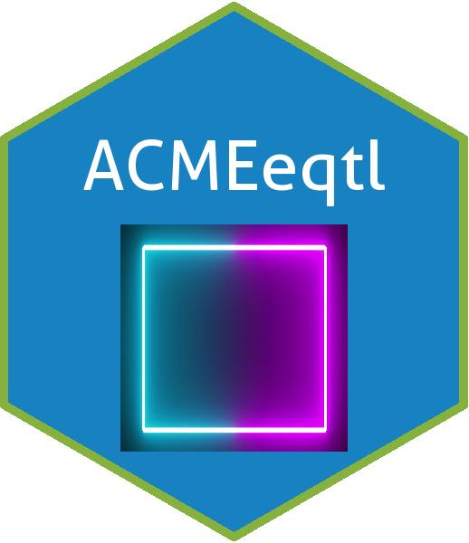

# Introduction
This is my work from the Google Code-in task 'Draw a hexagon logo for an R package'. Below you can see the code with comments.

# Prerequisites
- R
- RStudio
- hexSticker
- ggplot2

# Code Description
The code below can be copied to R and executed as is.

```
#Draw a hexagon logo for an R package

library ("hexSticker")
library("ggplot2")
library("ACMEeqtl")

Logo = imgurl=system.file("C:\\Users\\srish\\Desktop\\10.jpg", package="hexsticker")
sticker("C:\\Users\\srish\\Desktop\\10.jpg", package="ACMEeqtl", p_size=20, s_x=1, s_y=.75, s_width=.6,
        filename="logo.png")

```
# Logo 



# Author
- Srishti 
